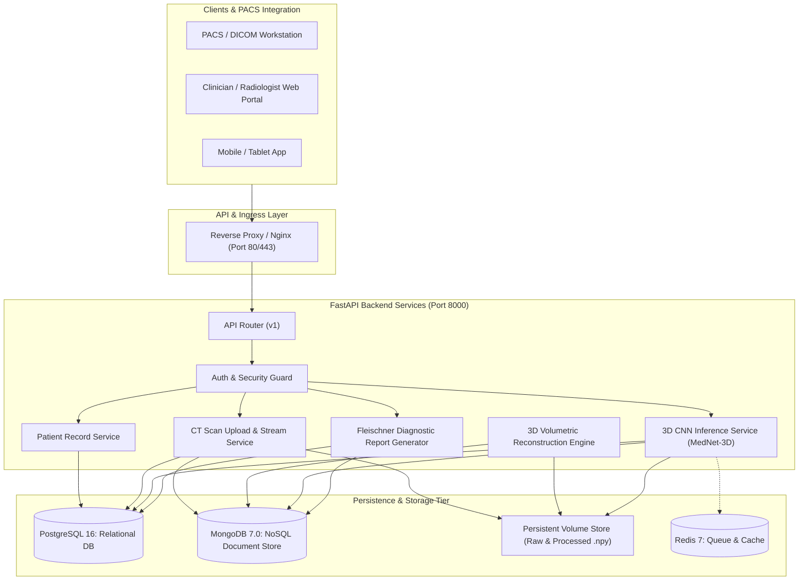
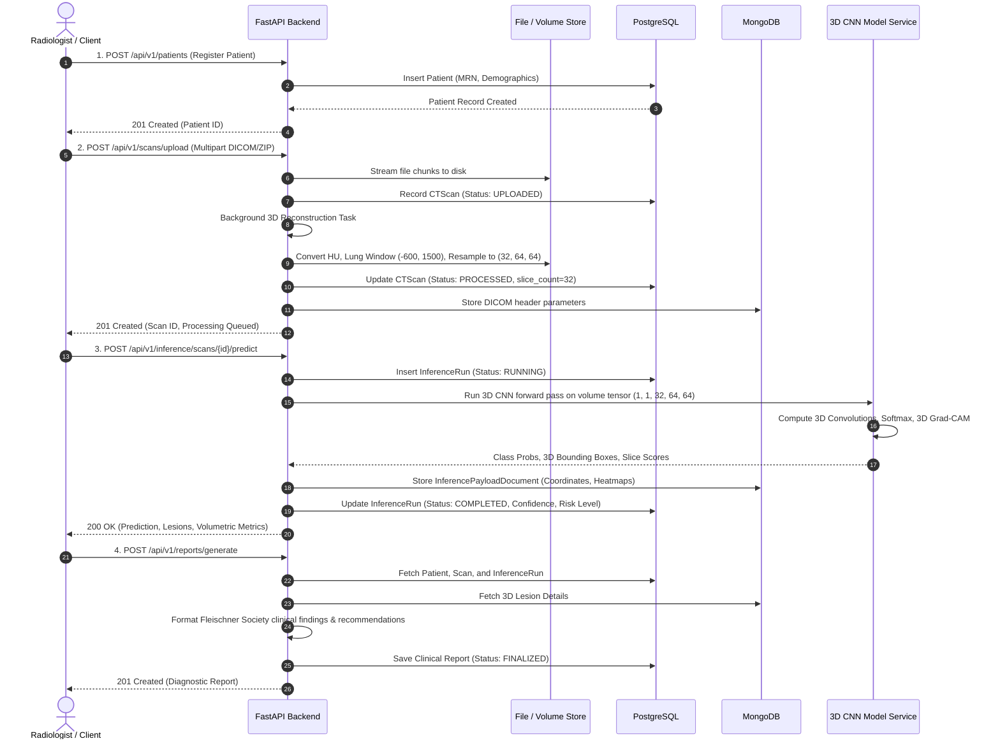

# MedVision 3D CT Diagnostic Backend - System Architecture & Design

## 1. Executive Architecture Overview

MedVision is an enterprise-grade medical AI backend designed for volumetric 3D Computed Tomography (CT) scan analysis, lesion localization, and automated clinical reporting.

---

## 2. Comparative Technology Evaluation

### A. FastAPI
- **Asynchronous Concurrency**: Built on Starlette and Uvicorn with native Python `async`/`await` support. High throughput for non-blocking I/O during large volumetric image file uploads and database writes.
- **Data Validation & Typing**: Integrated with Pydantic v2 for automatic request parsing, strict schema validation, and low latency serialization.
- **Automated OpenAPI / Swagger**: Generates live, interactive Swagger UI (`/docs`) and ReDoc (`/redoc`) documentation with zero maintenance overhead.

### B. PostgreSQL (Relational Database)
- **Role**: Serves as the primary source of truth for ACID-compliant structured medical records.
- **Entities**:
  - `patients`: Demographics, Medical Record Numbers (MRN), contact information, clinical histories.
  - `ct_scans`: Metadata indices, file storage paths, voxel dimensional parameters, processing lifecycle state.
  - `inference_runs`: Model versioning, run execution timestamps, categorical findings, confidence scores, risk categories, runtime latencies.
  - `reports`: Clinical diagnostic reports, radiologist signatures, sign-off timestamps.
- **Referential Integrity**: Foreign key constraints with cascading deletes ensure orphan-free medical records.

### C. MongoDB (NoSQL Document Store)
- **Role**: Stores high-dimensional, polymorphic, and semi-structured medical imaging data.
- **Collections**:
  - `dicom_metadata`: Variable-length DICOM header tags (e.g., manufacturer-specific tags, acquisition parameters, slice positions, rescale factors).
  - `inference_payloads`: Rich 3D lesion detections, 3D bounding box coordinates $[z_{\min}, z_{\max}, y_{\min}, y_{\max}, x_{\min}, x_{\max}]$, lesion millimeter centroids, volumetric segmentations, and slice-by-slice abnormality probability arrays.

### D. Docker & Container Orchestration
- **Reproducibility**: Guarantees identical C-extensions, CUDA/CPU math libraries, and Python runtime across staging and production.
- **Security & Compliance**: Runs as a non-root system user (`medvision`) adhering to healthcare security standards (HIPAA / GDPR).
- **Service Isolation**: Decouples API services, PostgreSQL, MongoDB, and Redis into separate network-isolated containers with internal health checks.

---

## 3. End-to-End Medical Data Flow

---

## 4. 3D Volumetric Preprocessing & CNN Inference Pipeline

### A. Hounsfield Unit (HU) Calibration
Raw DICOM pixel values $p$ are calibrated into physically meaningful tissue attenuation units:
$$\text{HU} = p \times \text{RescaleSlope} + \text{RescaleIntercept}$$

### B. Clinical Lung Windowing
CT scans contain a wide dynamic range $(-1024 \text{ to } +3000\text{ HU})$. For thoracic nodule detection, lung windowing is applied with Window Center $L = -600\text{ HU}$ and Window Width $W = 1500\text{ HU}$:
$$\text{Lower} = L - \frac{W}{2} = -1350\text{ HU}, \quad \text{Upper} = L + \frac{W}{2} = +150\text{ HU}$$
$$\text{HU}_{\text{norm}} = \frac{\text{clip}(\text{HU}, \text{Lower}, \text{Upper}) - \text{Lower}}{\text{Upper} - \text{Lower}} \in [0.0, 1.0]$$

### C. Standardized Volumetric Resampling
Scans are resampled to uniform tensor dimensions:
$$\mathbf{T} \in \mathbb{R}^{B \times C \times D \times H \times W} = (1, 1, 32, 64, 64)$$

### D. 3D CNN Architecture
- **Volumetric Convolutions**: $3 \times 3 \times 3$ 3D spatial filters capturing inter-slice continuity along the depth axis.
- **3D Batch Normalization & LeakyReLU**: Feature stability and non-linearity.
- **Global Average Pooling**: Dimensionality reduction preserving spatial invariant features.
- **Dense Softmax Classifier**: Outputs probabilities across classes:
  1. Normal / No Nodule
  2. Benign Pulmonary Nodule
  3. Malignant Suspicion
- **3D Grad-CAM Localization**: Computes gradient activation maps to delineate 3D bounding boxes and calculate millimeter lesion volumes.
